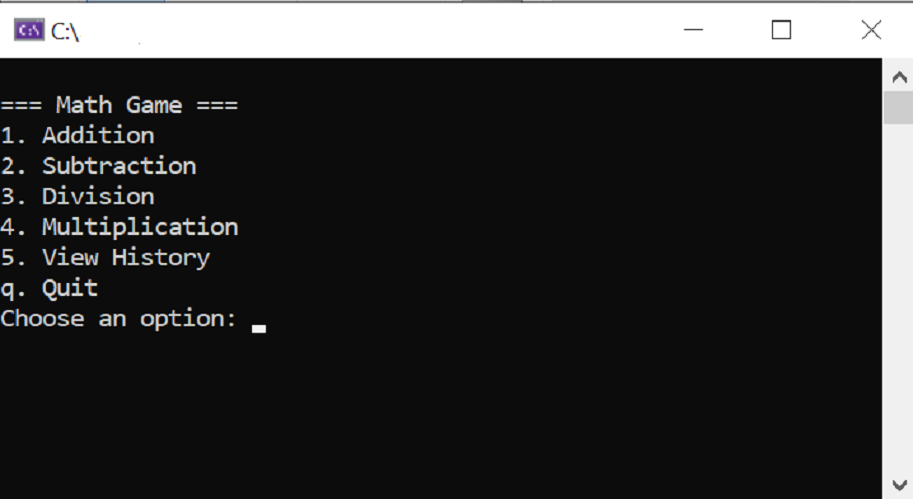
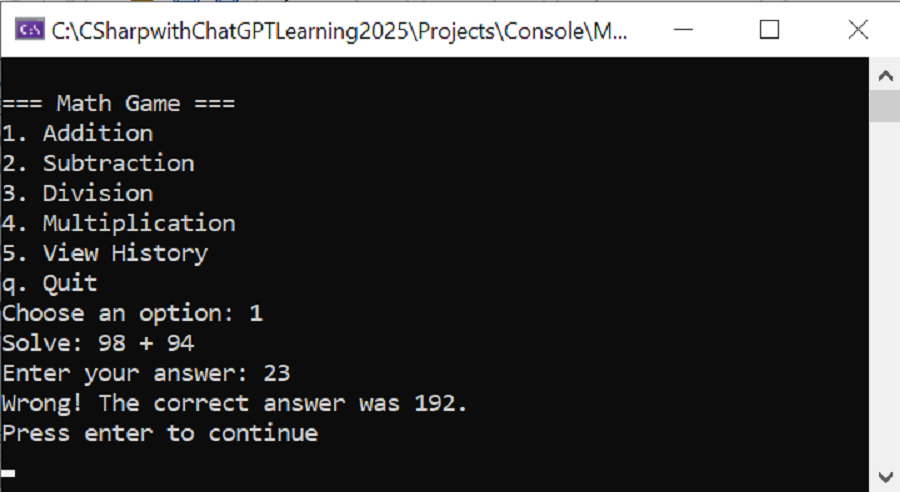
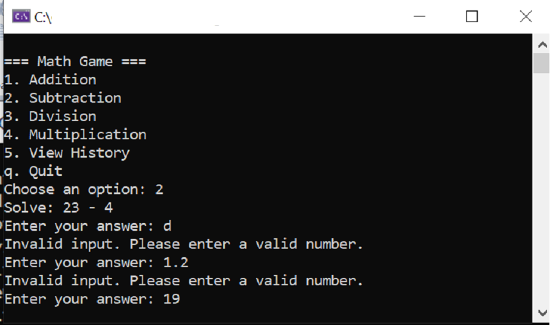
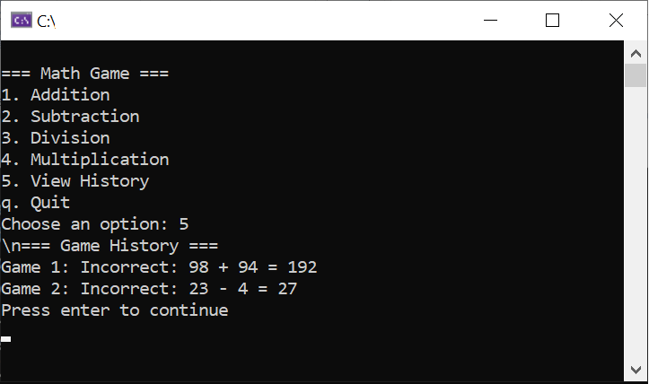

# MathGame
A MathGame for leaning how to create a Console Application. Logic and display are separated into different classes. History of games stored within a list. I have created a separate class for validation but thus has been commented out to use inline validation instead.

## Technlogies Used
* C#
* .NET 8
* Windows Console

##Using the App
1. Download the executable file from the release section.
2. When the application launches it should look like this:

   

3. Enter in you slection from the Main menu e.g. addition:

4. Enter in  an invalid value:

5. Show your game history:

